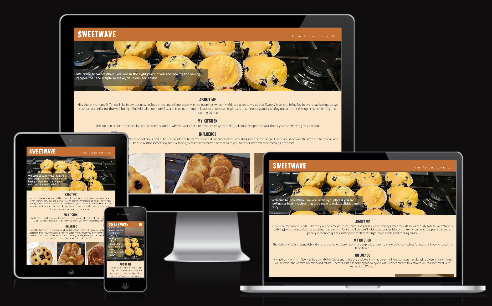
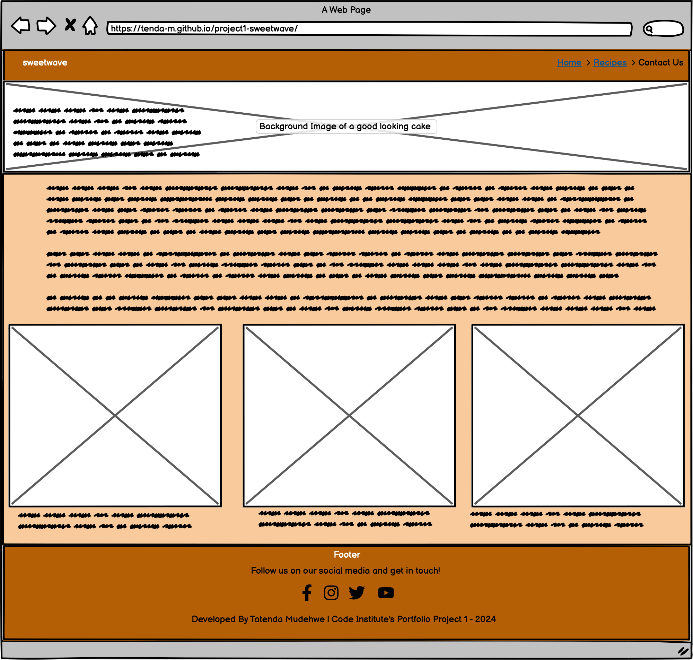
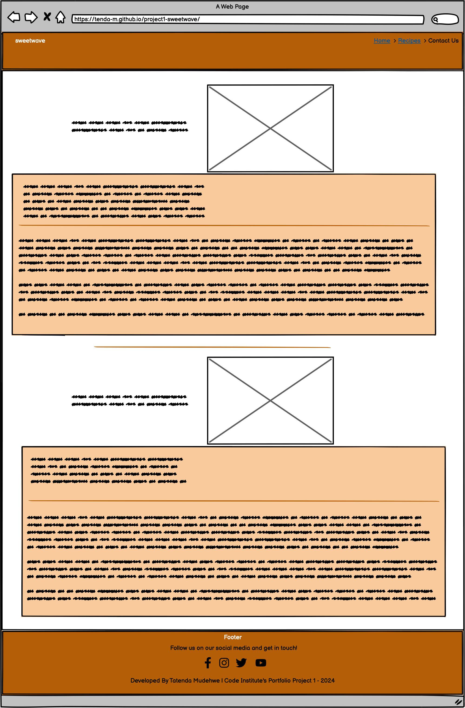

Welcome,

This is the Code Institute student template for Codeanywhere. If you are using Gitpod then you need [this template](https://github.com/Code-Institute-Org/gitpod-full-template) instead.  We have preinstalled all of the tools you need to get started. It's perfectly ok to use this template as the basis for your project submissions.

You can safely delete this README.md file, or change it for your own project. Please do read it at least once, though! It contains some important information about Codeanywhere and the extensions we use. Some of this information has been updated since the video content was created. The last update to this file was: **August 30th, 2023**

## Codeanywhere Reminders

To run a frontend (HTML, CSS, Javascript only) application in Codeanywhere, in the terminal, type:

`python3 -m http.server`

A button should appear to click: _Open Preview_ or _Open Browser_.

To run a frontend (HTML, CSS, Javascript only) application in Codeanywhere with no-cache, you can use this alias for `python3 -m http.server`.

`http_server`

To run a backend Python file, type `python3 app.py`, if your Python file is named `app.py` of course.

A button should appear to click: _Open Preview_ or _Open Browser_.

In Codeanywhere you have superuser security privileges by default. Therefore you do not need to use the `sudo` (superuser do) command in the bash terminal in any of the lessons.

To log into the Heroku toolbelt CLI:

1. Log in to your Heroku account and go to _Account Settings_ in the menu under your avatar.
2. Scroll down to the _API Key_ and click _Reveal_
3. Copy the key
4. In Codeanywhere, from the terminal, run `heroku_config`
5. Paste in your API key when asked

You can now use the `heroku` CLI program - try running `heroku apps` to confirm it works. This API key is unique and private to you so do not share it. If you accidentally make it public then you can create a new one with _Regenerate API Key_.

---

Happy coding!
--------------------------------------------------------------
## Sweetwave

Introducing Sweetwave: the place where chemistry meets your kitchen. Our website provides a variety of everyday recipes that are fantastic foundations for creating countless combinations and taste explorations. Sweetwave welcomes all bakers, regardless of experience level; we cover the fundamentals, essentials, and baking basics. Our recipes are simple to follow, and we offer artisan baking techniques, endless inspiration, and recipes for baking at home. 

## Demo

A live demo can be found [here.](https://tenda-m.github.io/project1-sweetwave/)

- - - 

# Contents
* [Languages Used](#languages-used)
* [User Experience](#user-experience-ux)
* [Design](#design)
  * [Wireframes](#wireframes)
  * [Features](#features)
  * [Future Implementations](#future-implementations)
  * [Color Scheme](#color-scheme)
  * [Typography](#typography)
  * [Icons](#icons)
* [Deployment](#deployment)
  * [Run locally](#run-locally)
  * [Testing](#testing)
* [Credits](#credits)
* [Acknowledgements](#acknowledgements)

- - -

# Languages Used
* HTML5
* CSS3

- - - 
# User Experience (UX)

## The ideal users for this community is:
 * Individuals passionate about baking. 
 * Based anywhere in the world online.
 * Individual looking to expand their knowlage for baking.
 * Individual looking to share baking feedback.

 ## User stories

### First Time Visitor Goals
* As a new visitor, I anticipate that I will be able to navigate the website with ease and quickly grasp its primary goal. 
 * I can effectively locate what I'm looking for.
 * Recognize the advantages the website offers.
 * Use the links to social media to stay informed about new recipe followers and comments.

### As a Returning Visitor
 * I would like to test out the recently added recipes. 
 *I would like to fill out a form in case I have any questions.

### As a Frequent User 
 * I would like to stay current on new recipes.

 # Design

## Wireframes:

* Home Page:

* Recipe Page:

* Contact Us Page:

- - -
